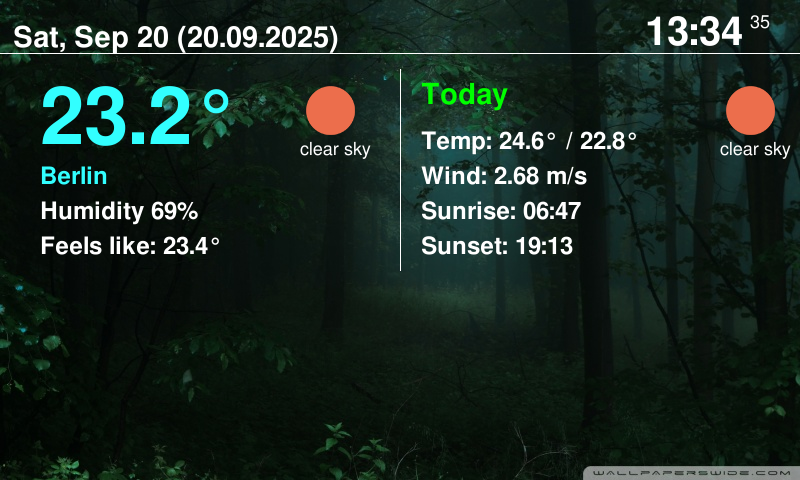

# raspi-openweather

Super light-weight full-screen weather display application. Memory footprint: RSS=140KB, VIRT=600KB.
Minimal CPU load. Optimized for 800x480 screen. Tested on RaspberryPi 4.

Uses free API key from https://openweathermap.org/ - simply register, create a new API key and save it
in the `open_weather.json` file (excluded from repo via `.gitignore` for security reasons). We're using
API endpoint that does not require any subscription or providing CC info.

Here's an example of `open_weather.json` with Berlin GPS coordinates (don't forget to update them
to your location):

```json
{
  "api_key": "PUT_YOUR_API_KEY_HERE",
  "lat":"52.513988",
  "lon":"13.358462"
}
```

Screenshot



## Original source
Github: https://github.com/granpino/raspi-openweather.git
The complete project is located at https://www.hackster.io/Granpino/raspberry-pi-open-weather-display-6f12a7
